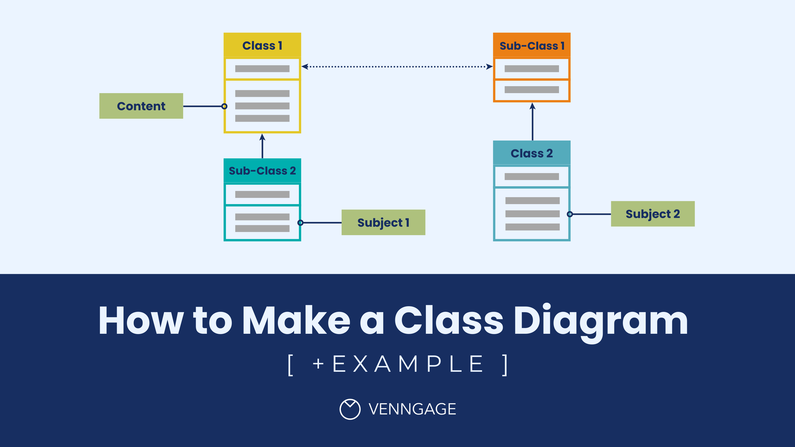

# Deployment

## Overview

Sealights allows you to collect code coverage and apply test selection to a Product.

**Product -** A collection of application components (microservices, web applications, monolith backend, etc.).

A complete Sealights installation of a product involves three logical steps:

1. **Scan the build artifacts** of the application components that you would like to report to Sealights. Scanning the application components will help Sealights understand which code should be tracked for code coverage and changes.&#x20;
2. **Collect Code Coverage.** In order to capture code coverage data & metadata from your application under tests while your tests are running.&#x20;
3. **Integrate into the test runner (test automation framework or manual runner).** In order to indicate to Sealights when a [Test Cycle](#user-content-fn-1)[^1] starts and to get [Test Recommendations.](#user-content-fn-2)[^2]


All of the aforementioned steps are mandatory, regardless of the Sealights offering you are using.


## <mark style="color:red;">Diagram Placeholder</mark>

<figure><figcaption></figcaption></figure>

## Deployment Types

There are two Deployment Types in Sealights:

1. **Simple Deployment -** Allows for quick onboarding of a <mark style="color:orange;">**product**</mark> composed of backend services for a single <mark style="color:orange;">**environment**</mark> and [<mark style="color:red;">**t**</mark><mark style="color:orange;">**est**</mark>](#user-content-fn-3)[^3] <mark style="color:orange;">**stage**</mark>. It allows you to use most of Sealights offering in a quick and easy setup. This is the recommended deployment for getting started with a new team.
2. **Advanced Deployment. -** Allows you to onboard a <mark style="color:orange;">**product**</mark> composed of multiple application components (backend services and front end) for multiple <mark style="color:orange;">**environments**</mark>, <mark style="color:orange;">**test stages**</mark>, and technologies.


For a complete comparison between Simple Deployment and Advanced Deployment, [click here](deployment-type-comparison.md).


Choose a deployment type:

<table data-view="cards"><thead><tr><th></th><th align="center"></th><th></th><th data-hidden data-card-target data-type="content-ref"></th></tr></thead><tbody><tr><td></td><td align="center">Simple Deployment</td><td></td><td><a href="simple-deployment/">simple-deployment</a></td></tr><tr><td></td><td align="center">Advance Deployment</td><td></td><td><a href="advanced-deployment.md">advanced-deployment.md</a></td></tr></tbody></table>

[^1]: A test cycle is a collection of tests organized to accomplish specific testing objectives, encompassing a broader scope than individual tests. Common examples are Regression Tests, End-To-End Tests, Manual Tests, and more.

[^2]: As part of the Test Optimization offering, Sealights recommends which tests should be run. This is done by considering historical runs of your tests and correlating them with your current code changes. You can accelerate your CI without compromising your quality by running these recommendations.

[^3]: Bla bla bla
